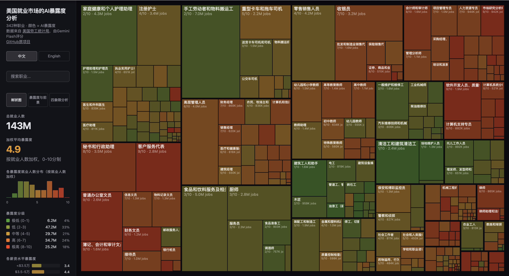
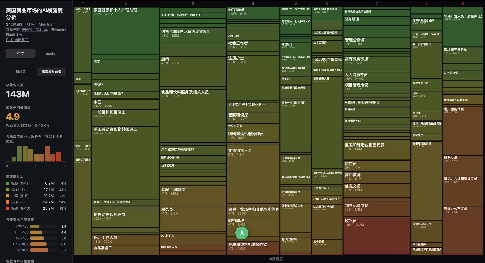

# 美国就业市场 AI 暴露度分析（中文版）

[](https://drrreistein.github.io/jobs-cn/)
[]()
[]()

> 本项目是 [karpathy/jobs](https://github.com/karpathy/jobs) 的完整中文翻译版本，将美国就业市场的 AI 暴露度可视化网站翻译为中文，方便中文用户理解和使用。

## 📊 项目简介

本网站可视化展示了美国 342 种职业受人工智能影响的程度。通过交互式树状图和散点图，用户可以直观地了解：

- 各职业的 AI 暴露度评分（0-10 分制）
- 不同行业的 AI 影响分布
- 薪资水平与 AI 暴露度的关系
- 教育要求与 AI 暴露度的关联
- 就业前景预测

**数据来源**: [美国劳工统计局 (BLS)](https://www.bls.gov/ooh/)  
**AI 评分**: 由 Google Gemini Flash 模型评估

## 🌐 在线访问

- **GitHub Pages**: https://drrreistein.github.io/jobs-cn/
- **本地运行**: 见下方说明

## ✨ 功能特点

### 交互式可视化
- **树状图视图**: 按职业类别展示 AI 暴露度分布，面积代表就业人数
- **暴露度与前景视图**: 展示 AI 暴露度与就业前景的关系

### 完整中文翻译
- 342 种职业名称
- 教育要求说明
- 就业前景描述
- 职业类别分类
- **AI 暴露度原因详细说明**（新增）

### 数据统计
- 总就业人数统计
- 加权平均暴露度
- 各暴露度等级分布
- 薪资与教育水平分析

## 📸 截图

### 树状图视图


### 暴露度与前景视图


## 🚀 快速开始

### 在线访问
直接访问 [GitHub Pages](https://drrreistein.github.io/jobs-cn/) 即可。

### 本地运行

```bash
# 克隆仓库
git clone https://github.com/Drrreistein/jobs-cn.git
cd jobs-cn

# 启动本地服务器（Python 3）
python3 -m http.server 8080

# 或使用 Python 2
python -m SimpleHTTPServer 8080
```

然后在浏览器中打开 http://localhost:8080

### 使用其他服务器

你也可以使用任何静态文件服务器，例如：

```bash
# 使用 Node.js 的 http-server
npx http-server -p 8080

# 使用 PHP 内置服务器
php -S localhost:8080
```

## 📁 项目结构

```
jobs-cn/
├── index.html          # 主页面（包含所有样式和脚本）
├── data.json           # 职业数据（含中文翻译）
├── README.md           # 项目说明文档
├── LICENSE             # 许可证（保留所有权利）
└── screenshots/        # 截图目录
    ├── treemap.png
    └── scatter.png
```

## 📊 数据说明

### AI 暴露度评分标准

AI 暴露度评分范围 0-10 分，含义如下：

| 评分 | 等级 | 说明 |
|------|------|------|
| 0-2 | 极低 | 几乎不受 AI 影响 |
| 2-4 | 低 | 受 AI 影响较小 |
| 4-6 | 中等 | 受 AI 中等程度影响 |
| 6-8 | 高 | 受 AI 影响较大 |
| 8-10 | 极高 | 极易受 AI 影响 |

### 数据字段说明

每个职业数据包含以下字段：

| 字段 | 说明 | 中文翻译字段 |
|------|------|-------------|
| `title` | 职业名称 | `title_cn` |
| `category` | 职业类别 | `category_cn` |
| `pay` | 年薪中位数（美元） | - |
| `jobs` | 就业人数（2024） | - |
| `outlook` | 就业前景变化率（%） | - |
| `outlook_desc` | 前景描述 | `outlook_desc_cn` |
| `education` | 教育要求 | `education_cn` |
| `exposure` | AI 暴露度评分 | - |
| `exposure_rationale` | AI 暴露度原因说明 | `exposure_rationale_cn` |

## 🌍 翻译详情

### 翻译覆盖率

| 字段 | 数量 | 覆盖率 |
|------|------|--------|
| 职业名称 | 342/342 | 100% |
| 教育要求 | 342/342 | 100% |
| 前景描述 | 342/342 | 100% |
| 职业类别 | 342/342 | 100% |
| AI 暴露度原因 | 342/342 | 100% |

### 翻译工具

- **字典映射翻译**: 职业名称、教育要求、前景描述、职业类别
- **API 机器翻译**: AI 暴露度原因说明（使用 Google Translate API）

## 🔧 技术栈

- **前端**: HTML5, CSS3, JavaScript (ES6+)
- **可视化**: [D3.js v7](https://d3js.org/)
- **数据格式**: JSON
- **翻译工具**: Python + deep-translator

## 📝 翻译示例

### 职业名称翻译
```
Accountants and auditors → 会计师和审计师
Software developers → 软件开发人员
Registered nurses → 注册护士
High school teachers → 高中教师
```

### AI 暴露度原因翻译

**原文（英文）**:
> Accountancy is a fundamentally digital occupation centered on data analysis, regulatory compliance, and reporting, all of which are highly susceptible to AI and robotic process automation.

**译文（中文）**:
> 会计从根本上来说是一种数字化职业，以数据分析、监管合规和报告为中心，所有这些都非常容易受到人工智能和机器人流程自动化的影响。虽然高级咨询角色和复杂的法证审计需要人工判断和关系管理，但数据组织、税务计算和异常检测等核心任务正日益被自动化，显著提高了工作效率并重组了入门级劳动力市场。

## ⚖️ 版权声明

### 原项目

本项目翻译自 [karpathy/jobs](https://github.com/karpathy/jobs)。

原项目未包含 LICENSE 文件，根据 GitHub 服务条款和相关版权法，原作者 **保留所有权利**。

### 本项目

本中文翻译版本同样 **保留所有权利**。未经原作者和本项目作者明确许可，不得：

- 商业使用
- 分发副本
- 修改或创建衍生作品

本项目仅供 **个人学习和研究使用**。

### 数据来源

职业数据来源于 [美国劳工统计局 (Bureau of Labor Statistics)](https://www.bls.gov/ooh/)，属于美国联邦政府公共领域数据。

## 🤝 致谢

- **原作者**: [Andrej Karpathy](https://github.com/karpathy) - 创建了原始的 AI 暴露度可视化项目
- **数据来源**: [美国劳工统计局](https://www.bls.gov/)
- **AI 评分**: Google Gemini Flash
- **翻译工具**: [deep-translator](https://github.com/nidhaloff/deep-translator)

## 📧 联系方式

如有问题或建议，欢迎：
- 提交 [Issue](https://github.com/Drrreistein/jobs-cn/issues)
- 发起 [Pull Request](https://github.com/Drrreistein/jobs-cn/pulls)

## 🔗 相关链接

- [原项目 (英文版)](https://github.com/karpathy/jobs)
- [原项目在线演示](https://ojobs.vercel.app/)
- [美国劳工统计局职业展望手册](https://www.bls.gov/ooh/)

---

⭐ 如果这个项目对你有帮助，欢迎 Star！
